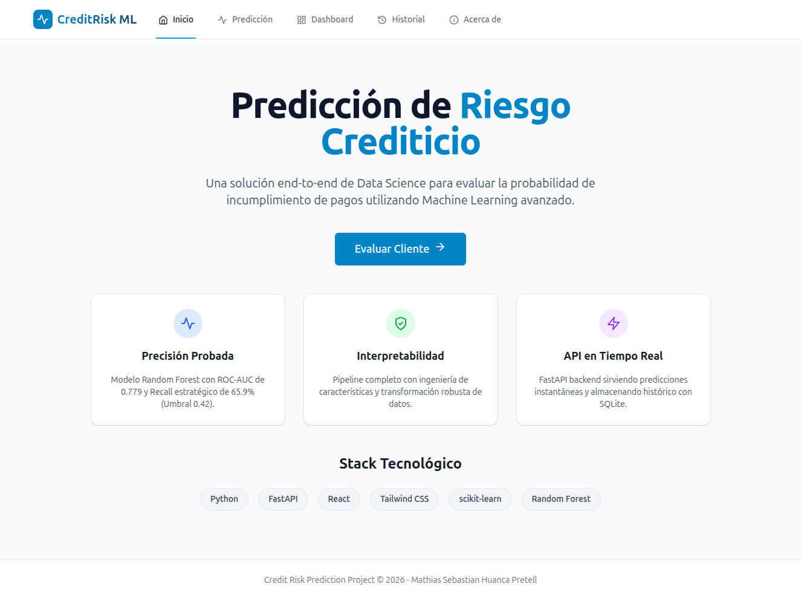
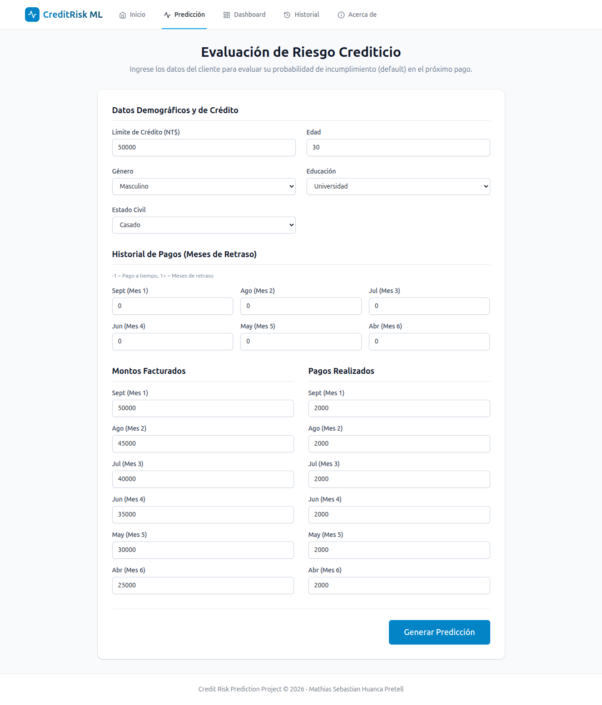
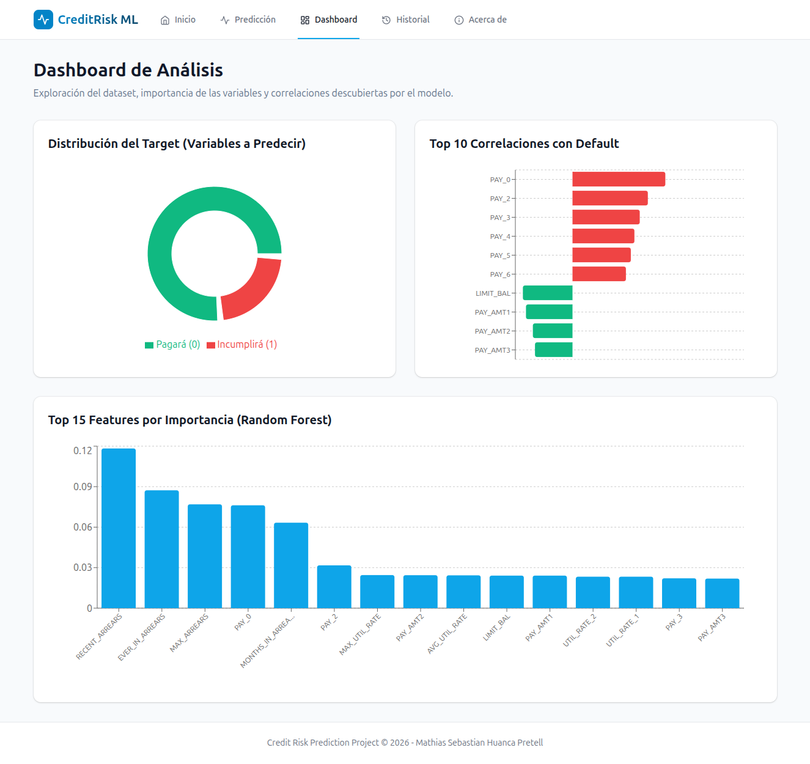
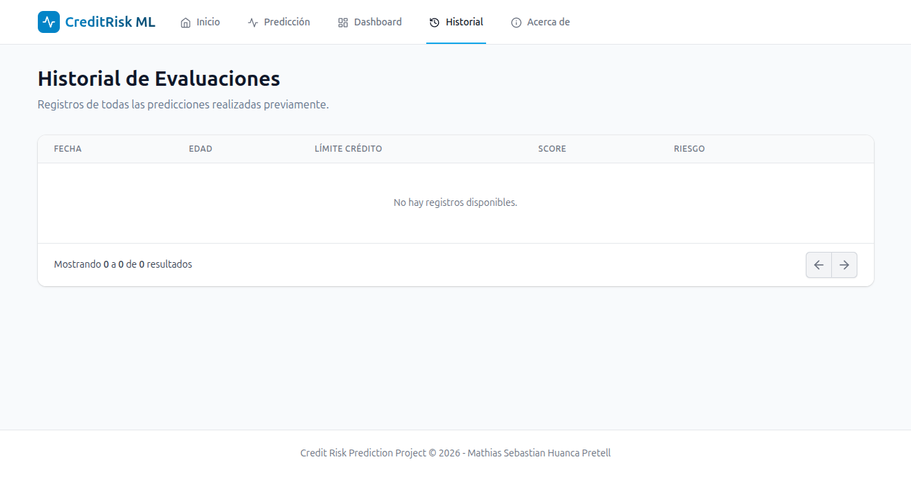
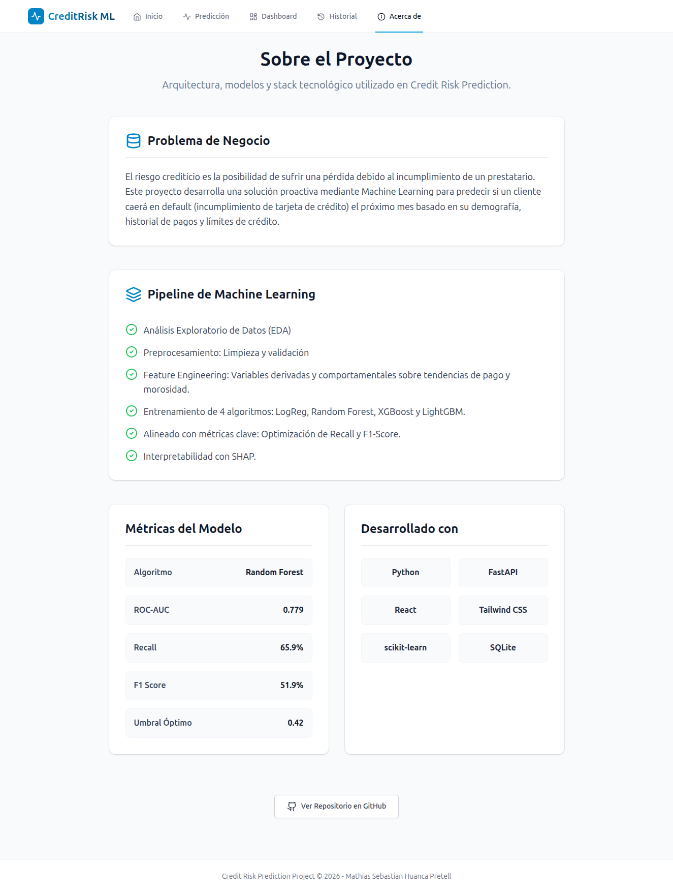

# Credit Risk Prediction — ML Pipeline + API + Dashboard

[](https://www.python.org/)
[](https://fastapi.tiangolo.com/)
[](https://reactjs.org/)
[](https://tailwindcss.com/)
[](https://scikit-learn.org/)
[](https://www.sqlite.org/)

## Descripción del Proyecto

El **riesgo crediticio** es la probabilidad de que un cliente o prestatario no cumpla con sus obligaciones de pago a tiempo. Para las instituciones financieras, predecir el comportamiento de pagos es crítico en la toma de decisiones para aceptar créditos, aumentar líneas o proponer programas de salvataje.

Este proyecto implementa una solución end-to-end en Data Science para evaluar la probabilidad de incumplimiento (default) basado en información demográfica, historial de comportamiento y estatus financiero de los últimos seis meses. La solución incluye un pipeline exhaustivo de Machine Learning, una API REST rápida para el servicio en tiempo real y componentes de visualización y predicción embebidos en una aplicación web interactiva (Dashboard).

El modelo fue entrenado con el dataset público **Default of Credit Card Clients** del [UCI Machine Learning Repository](https://archive.ics.uci.edu/dataset/350/default+of+credit+card+clients), que contiene información de 30.000 clientes de tarjetas de crédito de Taiwán. Cada registro incluye variables demográficas (edad, sexo, nivel educativo, estado civil), el límite de crédito asignado, el historial de pagos de los últimos 6 meses y los montos facturados y pagados en ese período. El 22% de los clientes incurrió en default, lo que representa un escenario realista de desbalance de clases típico en aplicaciones financieras reales.

El objetivo es no solo proveer una calificación de riesgo, sino comprender profundamente las variables (como la tasa de uso o Utilization Rate, ratios de pago entre otros features introducidos) y sus correlaciones, ofreciendo control, interpretabilidad y herramientas para un posible monitoreo preventivo.

## Estructura del Proyecto

```text
repositorio/
├── ml_pipeline/           # Notebooks y pipeline de Data Science
│   ├── data/
│   │   ├── raw/           # Dataset original UCI
│   │   └── processed/     # Datasets procesados, scalers y feature cols
│   ├── models/            # Modelo entrenado y metadatos
│   ├── notebooks/         # 6 notebooks del pipeline completo
│   └── requirements.txt
├── backend/               # API REST FastAPI (Python)
│   ├── app/
│   │   ├── main.py
│   │   ├── routes/        # Endpoints de /predict, /charts y /history
│   │   ├── services/      # Lógica del modelo y transformaciones de ML
│   │   ├── database/      # Conexión SQLite y modelos SQLAlchemy
│   │   └── schemas/       # Modelos Pydantic para validación de datos
│   ├── data/              # Datasets preprocesados y scalers
│   ├── models/            # Artefactos del modelo entrenado
│   ├── requirements.txt
│   └── .env.example
├── frontend/              # SPA React + Vite + TailwindCSS
│   ├── src/
│   │   ├── components/    # Componentes reutilizables, formularios y gráficos
│   │   ├── pages/         # Home, Predict, Dashboard, History, About
│   │   └── services/      # Integración con la API
│   ├── package.json
│   ├── tailwind.config.js
│   └── .env.example
├── screenshots/           # Capturas de la interfaz
└── README.md
```

## Módulos de la Solución

### 1. ML Pipeline

Flujo fundacional de exploración y modelado:

- **Análisis Exploratorio y Preprocesamiento:** Imputación de nulos, detección de _outliers_ y validación distribucional.
- **Feature Engineering Avanzado:** Generación de 14 _features_ valiosos como `UTIL_RATE`, `PAY_RATIO`, `MONTHS_IN_ARREARS`, entre otros para potenciar el entendimiento del fenómeno de la mora.
- **Modelado y Experimentación:** Entrenamiento y evaluación de 4 potentes algoritmos (Regresión Logística, Random Forest, XGBoost, LightGBM).
- **Interpretabilidad:** SHAP summary plots para identificar la influencia de los _features_.

### 2. Backend API

Componente de servicio en Python usando **FastAPI**.

- Implementación de una arquitectura ligera y limpia.
- Transcribe con exactitud el pipeline de procesamiento dinámico en su ejecución en vivo (clipping, robust scaling, log transformations y reagrupación categórica).
- Persistencia local usando **SQLite** mediado por SQLAlchemy ORM.
- Endpoints para inferencia en tiempo real y consumo de analíticas gráficas.

### 3. Frontend Web App

Aplicación interactiva y adaptable con **React** + **Vite**.

- Diseño moderno y profesional configurado mediante **Tailwind CSS**.
- **Dashboard** que resume los _insights_ visuales (distribución del dataset original, Features Top 15 importancias extraídas del modelo Random Forest, y matriz de correlación).
- **Predict UI:** Formulario estructurado y validado con visualizaciones en _badge_ condicional (Verde Riesgo Bajo / Amarillo Riesgo Moderado / Rojo Riesgo Alto).
- Gestión de histórico de clientes analizados y visualizaciones de negocio.

## Métricas del Modelo Escogido

El estimador seleccionado para producción fue el **Random Forest Classifier**:

- **ROC-AUC Score:** `0.779`
- **Recall (Sensibilidad):** `65.9%` (Alto enfoque en detectar correctamenta a los morosos)
- **F1 Score:** `51.9%`
- **Umbral de Decisión (_Decision Threshold_):** `0.42`

## Cómo Ejecutar

### Desplegar el Backend

1. Navega a la carpeta `/backend/`
2. Instala las dependencias: `pip install -r requirements.txt`
3. Renombra `.env.example` a `.env` si es necesario o utiliza la configuración por defecto (variables embebidas por código).
4. Levanta el servidor:

```bash
uvicorn app.main:app --reload
# El servicio correrá en http://localhost:8000
# Documentación interactiva en http://localhost:8000/docs
```

### Desplegar el Frontend

1. Navega a la carpeta `/frontend/`
2. Instala los paquetes empaquetadores de Node:
   _(Asegúrate de tener Node.js instalado si trabajas en entorno local)_

```bash
npm install
```

3. Renombra `.env.example` a `.env`
4. Inicia el servidor de desarrollo:

```bash
npm run dev
# La aplicación estará disponible usualmente en http://localhost:5173
```

## Screenshots de la Interfaz

### Home



### Predicción



### Dashboard



### Historial



### Acerca de



## Demo

- [Ver aplicación en vivo](https://credit-risk-ml-rust.vercel.app)
- [API Documentation](https://credit-risk-api-9e3u.onrender.com/docs)

> ⚠️ El backend está desplegado en **Render** (plan gratuito) y el frontend en **Vercel**. Si el backend no recibe tráfico por un tiempo, puede tardar hasta 50 segundos en responder la primera solicitud.

**Autor:** Mathias Sebastian Huanca Pretell
